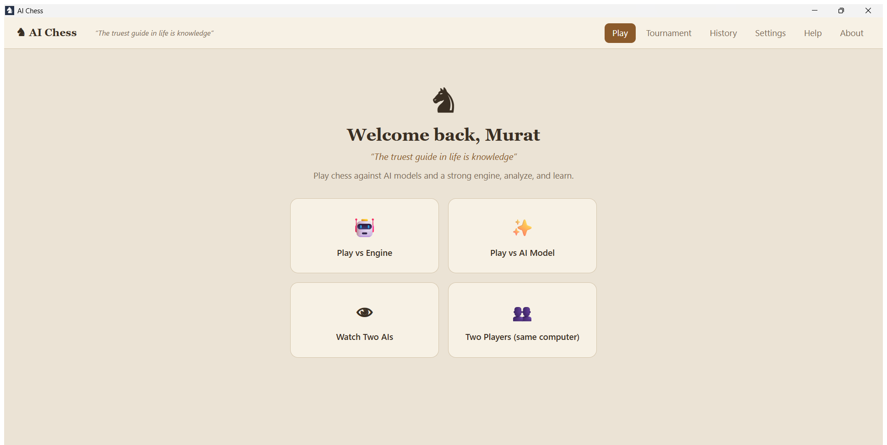
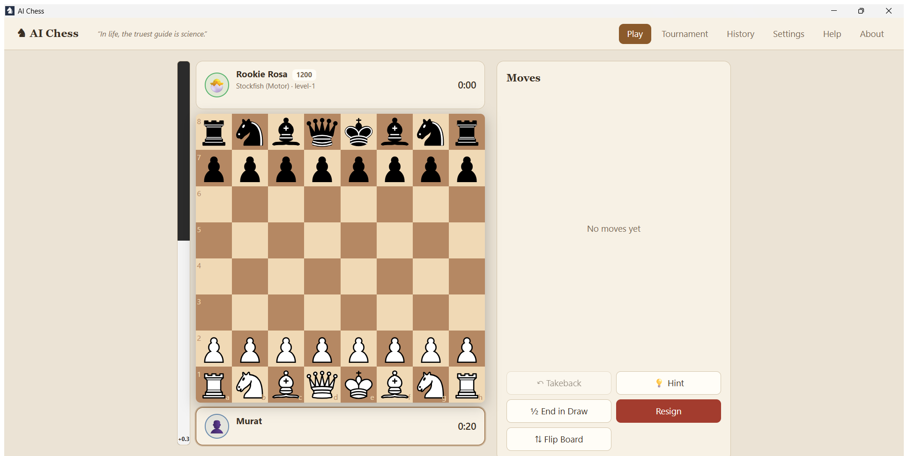
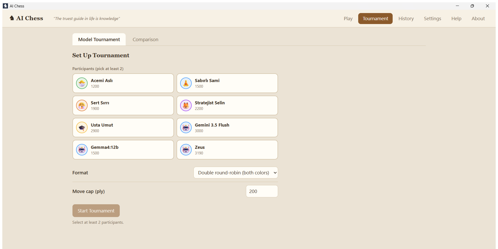
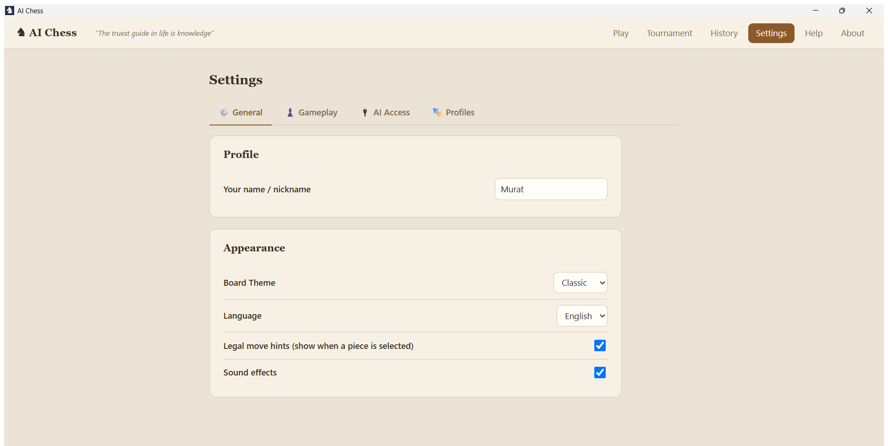

<div align="center">

# ♞ AI Chess

### Play chess against AI models and the powerful Stockfish engine

*"In life, the truest guide is science."*

Claude · ChatGPT · Gemini · Ollama · OpenAI-compatible services · Stockfish 18

**Tauri** • **React** • **TypeScript** • **chess.js** • **SQLite**

</div>

---

## 📸 Screenshots

<div align="center">



| Play | Tournament | Settings |
|:---:|:---:|:---:|
|  |  |  |

</div>

---

## 📖 What is it?

**AI Chess** is a **desktop application** where you can play chess against AI models and
the embedded **Stockfish** engine, and record and analyze your games. No installation
required — double-click a single `AI Chess.exe` and start playing.

Play against cloud models (Claude, ChatGPT, Gemini) and local models (Ollama, Open WebUI,
OpenRouter, LM Studio); watch two models play each other; and analyze your games at a
chess.com-grade level of detail.

---

## ✨ Features

### 🎮 Game Modes
- **Human vs AI** — play against an AI model or Stockfish
- **AI vs AI** — pit two models against each other and watch (pause / speed control)
- **Human vs Human** — two players on the same computer

### 🤖 Opponents
- **Stockfish 18 engine** (embedded, no key, offline) — 8 levels, ELO ~1320–3190
- **Claude · ChatGPT · Gemini** — enter your API key
- **Ollama** (local models) — enter your address, no key required
- **OpenAI-compatible endpoints** — Open WebUI, OpenRouter, LM Studio…

### 🎭 Profiles (like chess.com bots)
- 5 ready-made personas (Beginner → Master)
- **Create your own profile:** model + name + emoji avatar + color + rating + **personality prompt**
- The personality prompt shapes the model's playing style (e.g. *"Play aggressively, love gambits"*)

### 🔬 Analysis (Stockfish)
- Live **evaluation bar**
- **Analyze Game:** each move labeled *Best / Good / Inaccuracy / Mistake / Blunder*, plus
  **brilliant move (!!)** detection
- **Accuracy %** and **evaluation graph**
- **Multi-line** (top 3 variations) + best-move arrow on the board
- **Review** mode (step through mistakes)

### 📝 Records, Replay, Report
- Every game is saved to SQLite (date, time, moves, model, result, opening name)
- **Replay:** auto-play (0.5x–4x), step by step, jump to any move
- **AI Match Report:** a model analyzes the game and writes a Markdown report → save as `.md`
- **PGN export**

### 🎨 Interface
- 2 themes: **Classic** (wood + staunton pieces) and **Modern** (gray-blue + flat pieces)
- Legal-move hints, undo, draw, rematch, flip board, start from FEN
- Optional chess clock (blitz / rapid)
- Captured pieces + material indicator, move/capture/check sounds, keyboard support
- **Turkish / English** language switcher

---

## 🚀 Installation & Usage

### End user
1. Double-click **`AI Chess.exe`** (no installation required, portable)
2. Enter **your name** on first launch
3. **Play** → start against a profile/model
   - To try instantly without a key, use the **Stockfish profiles** or **"Play vs Engine"**
4. Enter your API keys / Ollama address under **Settings → AI Providers**

### API Keys
Keys are entered **inside the app** (Settings) and stored **DPAPI-encrypted** in the SQLite
`secrets` table (`%APPDATA%\com.murat.chess\`). **They are never written to source code or
the repo**, nor to `settings.json` in plain text — by design.

### Data
All games live in `%APPDATA%\com.murat.chess\chess.db`. To back up, copy that file.

### Auto-update
The app checks for new versions via **GitHub Releases**. Open **About → Check for Updates**;
if a newer signed version exists, it downloads and installs it, then restarts.

---

## 🛠️ Development

### Prerequisites
- Node.js 20+
- Rust **1.90.0** (pinned via `rust-toolchain.toml`)
- On Windows, **Visual Studio 2019 BuildTools** (C++ desktop workload)

### Commands
```bash
npm install
npm run dev          # Vite dev server (browser, partial)
npm run tauri dev    # desktop window (development)
npm test             # vitest unit tests
npx tsc --noEmit     # type check
```

### Production build (Windows — CRITICAL)
On this machine the C++ linker requires the **VS2019 BuildTools** environment. Ready script:
```bat
build-tauri.bat build
```
or manually:
```bat
call "C:\Program Files (x86)\Microsoft Visual Studio\2019\BuildTools\VC\Auxiliary\Build\vcvars64.bat"
set "PATH=%USERPROFILE%\.cargo\bin;%PATH%"
npm run tauri build
```
Output: `src-tauri/target/release/ai-chess.exe` (~13 MB) and the NSIS installer.

> ⚠️ Rust 1.96 triggers a `tauri-utils` E0119 error; **use 1.90.0**.
> The `time` crate is pinned at **0.3.47** (0.3.48 is broken).

---

## 🗂️ Architecture

```
src/                      React + TS (all application logic)
  engine/                 Stockfish driver, analysis, opening detection
  llm/                    prompt, parseMove, moveService, providers/, httpProxy
  store/                  gameStore, settingsStore (Zustand)
  components/, pages/      UI
src-tauri/                Rust core: http_proxy command + SQL migrations
public/engine/            Stockfish 18 Lite WASM (embedded)
```

| Layer | Technology |
|---|---|
| Desktop shell | Tauri 2 (WebView2) |
| UI | React 19 + TypeScript |
| Rules engine | chess.js |
| Board | react-chessboard |
| Analysis engine | Stockfish 18 Lite (WASM, Web Worker) |
| State | Zustand |
| Database | SQLite (tauri-plugin-sql) |

---

## 🧠 Technical Notes

- **Ollama CORS:** Requests go through the Rust backend (reqwest, `http_proxy`) — since the
  webview origin is not sent, Ollama's 403 rejection is never triggered.
- **"Thinking" models (gemma, etc.):** `think: false` is added to move requests; otherwise the
  model spends seconds on reasoning and hits the token limit. Tested: gemma4:12b had
  0 fallbacks, ~615ms/move.
- **Illegal-move guarantee:** Free reasoning + parser + a 4-attempt feedback loop; as a last
  resort, a random legal move (the game never stalls).

For details, see [`CHANGELOG.md`](./CHANGELOG.md).

---

## 📜 License

This project is licensed under **GPL-3.0** — because **Stockfish** (GPL-3.0) is embedded as
the chess engine. Details: [`LICENSE`](./LICENSE) and
[`THIRD-PARTY-NOTICES.md`](./THIRD-PARTY-NOTICES.md).

- ✅ Commercial use and sale are permitted.
- ⚠️ When distributing, the **full source code** must be provided under GPL-3.0 terms; it
  cannot be made proprietary (closed-source). For a closed product, Stockfish must not be
  embedded — instead rely on a UCI engine installed separately by the user.

> This is not legal advice; consult a lawyer for certainty.

---

## 👤 Developer

**Murat Bahçetepe**

The designer and developer of this application, aiming to build an enjoyable, professional
tool at the intersection of artificial intelligence, chess, and software. Feel free to reach
out for feedback, suggestions, bug reports, or collaboration:

📧 **[mbahcetepe@gmail.com](mailto:mbahcetepe@gmail.com)**

<div align="center">

*"In life, the truest guide is science."*

</div>
